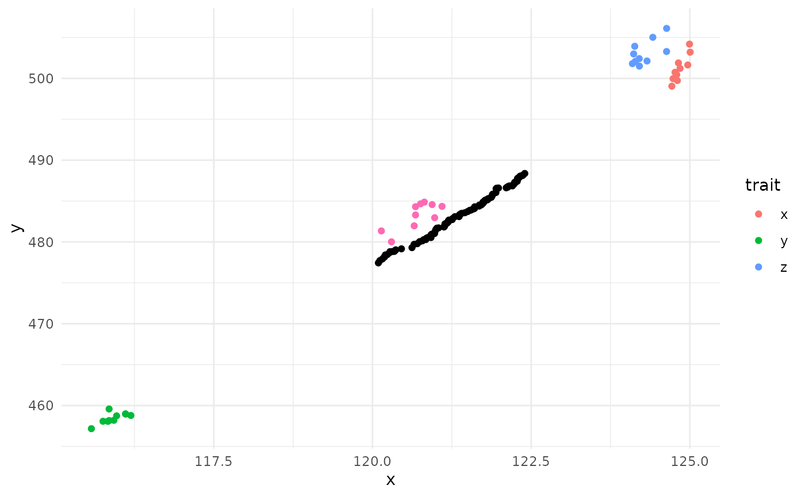
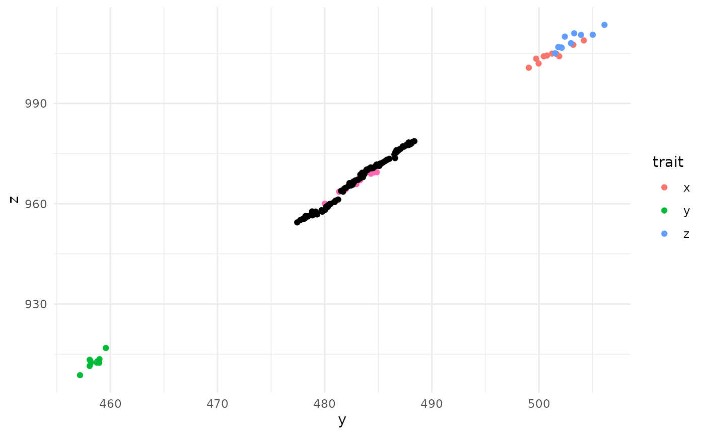
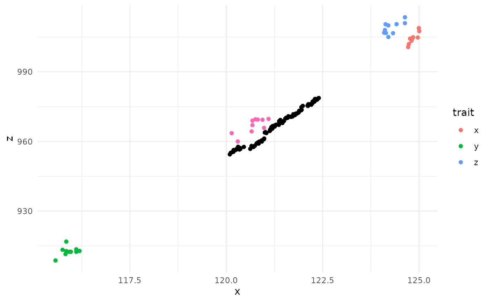

# overview

``` r

library(MultiOpt)
```

## Basics of simulated annealing

## understanding this package: what it does and doesnt do

## A simple example

### Loading data

For now we will generate some data to look at. This data is weakly
positively correlated.

``` r


n <- 100 # how many "individuals" we want in our sample

set.seed(12345)
x = rnorm(n = n, mean = 120, sd = 2)
y = x * 4 + rnorm(n = n, mean = 0, sd = 5)
z = y * 2 + rnorm(n = n, mean = 0, sd = 5)

dat = data.frame(x = x, y = y, z = z)

head(dat)
#>          x        y        z
#> 1 121.1711 485.8039 964.4270
#> 2 121.4189 479.8946 956.6429
#> 3 119.7814 481.2377 963.6929
#> 4 119.0930 469.7482 944.7883
#> 5 121.2118 485.5525 975.2618
#> 6 116.3641 462.7761 926.0783
```

### Formatting data

#### “trait” data

Expected formatting for trait data is a list of matrices. Here we are
just working with vectors, but pairwise matrices of distances (genetic
or otherwise) can also but added to the list.

The package refers to provided data as “trait” data, but this is in the
broad sense and can include phenotypic or genotypic data, so long as it
can be put into a matrix.

``` r

trait_list = list(
  x = as.matrix(dat$x),
  y = as.matrix(dat$y),
  z = as.matrix(dat$z)
)
```

This list would work, however, as soon as you try and run the simulation
you would notice a warning about the scales of the traits being off.
This is an important consideration for your simulation. If the scales of
your traits are considerably different, the trait with the larger values
would be “favored” in the simulation if `p_depends_delta = TRUE`, as the
larger differences in values between samples are larger and thus more
important to the algorithm. Thus, its a good idea to transform your data
before running simulated annealing. Fortunately, we have a function to
do so.

``` r

trait_list_scaled <- scale_traits(trait_list)
```

#### Measures

Now we need to specify what out exact goals are for each of these
traits. Some basic goals would be minimizing or maximizing a trait
(e.g., minimizing inbreeding vs maximizing genetic diversity), or even
maximizing variance (e.g., preserving phenotypes preventing selection
when subsetting). There are quite a few options, see
[`multiopt_sa()`](https://herz6627.github.io/MultiOpt/reference/multiopt_sa.md)
for more details. INSERT TABLE WITH DESCRIPTIONS HERE??? We can pick the
direction of the measure in the arguments parameter, described next.

Again, this information needs to be in a list, with each list element
being the function we want to use to measure success. For simplicity,
we’ll just go with summarizing the measures with a mean of our trait
data, which are vectors, and thus why we will pick
`weighted_mean_of_vector`. Weighting is indicating the mean is modified
by how many times an individiual is chosen.

``` r

measure_list = list(
  x = weighted_mean_of_vector,
  y = weighted_mean_of_vector,
  z = weighted_mean_of_vector
)
```

#### Measure arguments

Some arguments require specialized parameter specification; here is
where you can add those details. The arguments are also where you can
specify what direction of success you are interested in (minimizing or
maximizing, specified by direction = 1 or -1). Again, this needs to be a
list. All trait names need to match between the trait, measures, and
argument lists.

Let’s choose to maximize the first two traits (`x`, and `y`), but
minimize `z`. Since we are just doing a simple mean, we dont need to
supply any other arguments

``` r

args_list = list(
  x = NULL, # dont need any special arguments here
  y = NULL,
  z = list(direction = -1) # -1 here indicates we want to get the minimum value of the measure
)
```

### A basic analysis

``` r

# how many "individuals" or samples we want in the final population
n_t = 50 

# maximum number of times an individual can be chosen in the population. 
# Here we are selecting an individual a maximum time of 1. 
# You could select an individual multiple times for example when taking cuttings or collecting seeds from a selfed individual.
weights_max = 1 

# initial_weights = sample(c(rep(1, n_t), rep(0, n-n_t))) # if you have an idea of what individuals are going to be best you can start the simulation off with those. There we are just picking the first `n_t` individuals. This argument isnt needed if specifying n_t.
```

And with that we can start a simulation:

``` r

out <- multiopt_sa(
  trait_list = trait_list_scaled,
  measure_list = measure_list,
  measure_args_list = args_list,
  n_t = n_t, 
  weights_max = weights_max,
  verbose = F
)
```

#### Take a look at the results

``` r

plot(out$chain$values[,1], type = "l") # trait x
```


``` r

plot(out$chain$values[,2], type = "l") # trait y
```


``` r

plot(out$chain$values[,3], type = "l") # trait z
```


What we want to see an lots of bouncing around in the beginning,
indicating the algorithm was exploring. As the temperature cools, we
want to see a gradual increase in value, with the final iterations being
fairly stable. With three trait dimentions the trait relationships can
get a bit convoluted. Here we can see very nice simulation results of
our “chain” (what the algorithm decided as the temperature cooled) for
two of the traits (`x` and `y`), but the opposite of what we would
expect for the last trait (`z`). If we think back to how we generated
our data, we made all the traits weakly positively correlated, then
chose to maximize two of them and minimize the last one. So it was easy
for the algorithm to maximize two traits (since they were positively
correlated), but since the last trait was going in the opposite
direction, it was not prioritized (as two traits being improved is
better one trait improving). So these results make sense in the setup we
provided.

We can also back transform the output to make the results a bit more
interpretable.

``` r

out_unscaled <- unscale_multiopt(trait_list = trait_list, multiopt_output = out)

plot(out_unscaled$chain$values[,1], type = "l") # trait x
```


``` r

plot(out_unscaled$chain$values[,2], type = "l") # trait y
```


``` r

plot(out_unscaled$chain$values[,3], type = "l") # trait z
```


### Understanding what parameter settings are doing

One of the limitations with simulated annealing is that you will need to
modify the starting parameters for each new combination of data and
objective, as the analysis can be quite sensitive to each of the
settings

temperature (min and max) iterations (max_steps)

### A more complicated analysis

#### Randomizations

Simulated annealing, by definition, is a stochastic optimizer. As such,
it is almost certain that results of each simulated annealing run will
result in slightly different final results. As such, it would be good
practice to run the process a few times to confirm the general range of
expected values. Replication will also allow you to see which
individuals are more frequently selected for the final populaiton mix,
allowing you to prioritize which individuals to select for your goals.

MultiOpt has a wrapper for `multiopt_sa` that allows for replication of
simulated annealing with a simplified output of the results, making it
easier to get a nice list of replicated results:
``` rand_multiopt``. Parameters are virtually the same between ```multiopt_sa`and`rand_multiopt`since they are doing the same task. The only additional information`rand_multiopt`needs is how many times you want to repeat the analysis (`n_runs`), and if you want to run the repeats in parallel (`parallel\`).
Note that it probably isn’t necessary to run analyses in parallel unless
you are doing a lot of replicates or very long simulations.

Using the same data and settings we generated earlier, the setup is very
similar:

``` r

# arguments for simulated annealing need to go into a named list
sa_args = list(
  trait_list = trait_list_scaled,
  measure_list = measure_list,
  measure_args_list = args_list,
  n_t = n_t, 
  weights_max = weights_max,
  max_t = 2,
  max_steps = 5000, # this should be increased when running an actual analysis
  nda = T,
  nd_samples = 500
)

multi_out = rand_multiopt(n_runs = 5, multiopt_args = sa_args, parallel = F)
#> Starting simulation at 2026-06-30 14:33:07.69028
#> Work completed in 0.58 minutes

str(multi_out)
#> List of 3
#>  $ measure_summaries: num [1:5, 1:3] 0.655 0.667 0.656 0.664 0.627 ...
#>   ..- attr(*, "dimnames")=List of 2
#>   .. ..$ : NULL
#>   .. ..$ : chr [1:3] "x" "y" "z"
#>  $ individs_selected: num [1:5, 1:100] 1 1 1 0 1 1 1 1 0 1 ...
#>  $ archive          :List of 2
#>   ..$ archive_summary: num [1:4, 1:3] 0.665 0.669 0.673 0.678 0.668 ...
#>   .. ..- attr(*, "dimnames")=List of 2
#>   .. .. ..$ : NULL
#>   .. .. ..$ : chr [1:3] "x" "y" "z"
#>   ..$ archive_weights: num [1:4, 1:100] 0 0 1 1 0 1 1 0 1 1 ...
#>   .. ..- attr(*, "dimnames")=List of 2
#>   .. .. ..$ : chr [1:4] "" "" "" ""
#>   .. .. ..$ : NULL
```

To run in parallel you simply need to set up the session and specify
`parallel = T`:

``` r

library(future)

future::plan(multisession, workers = 4) # multisession indicates this is run on current machine
multi_out = rand_multiopt(n_runs = 5, multiopt_args = sa_args, parallel = T)
#> Starting simulation at 2026-06-30 14:33:43.394705
#> Work completed in 0.46 minutes

str(multi_out)
#> List of 3
#>  $ measure_summaries: num [1:5, 1:3] 0.672 0.634 0.654 0.655 0.663 ...
#>   ..- attr(*, "dimnames")=List of 2
#>   .. ..$ : NULL
#>   .. ..$ : chr [1:3] "x" "y" "z"
#>  $ individs_selected: num [1:5, 1:100] 1 1 1 1 1 0 1 1 0 0 ...
#>  $ archive          :List of 2
#>   ..$ archive_summary: num [1:2, 1:3] 0.683 0.675 0.664 0.667 -0.622 ...
#>   .. ..- attr(*, "dimnames")=List of 2
#>   .. .. ..$ : NULL
#>   .. .. ..$ : chr [1:3] "x" "y" "z"
#>   ..$ archive_weights: num [1:2, 1:100] 1 1 0 0 0 0 0 0 0 0 ...
#>   .. ..- attr(*, "dimnames")=List of 2
#>   .. .. ..$ : chr [1:2] "" ""
#>   .. .. ..$ : NULL
```

And let’s look at the results for the first two objectives (traits):

``` r

plot(multi_out$measure_summaries)
```


As you can see, results are similar for each iteration but not quite the
same.

#### Exploring the Pareto Front further

While the final solutions from simulated annealing are informative, we
are also interested in trade offs between our objectives are, or the
Pareto Front. The Pareto front are the solutions found during the
simulated annealing run that are “non-dominated”, or the best choices
given multiple conflicting goals. A solution (an option in the simulated
annealing chain) is non-dominated if you cannot improve an objective
without sacrificing performance in at least one other objective.

In short, the Pareto Front shows us what the best-case solutions are
when there are trade-offs. The collection of these non-dominated
solutions are the Pareto Front, or the “archive.” An archive can be
generated by both `multiopt_sa` and `rand_multiopt` with the setting
`nda`. all the archive values generated by each run in `rand_multiopt`
are combined into a single archive, which is helpful to give a more
complete idea of what the tradeoffs are. If you wish to try and get more
values for your archive you can use `expplor_pareto`, which uses the
already generated Pareto Front as a starting point to keep looking for
non-dominated solutions.

``` r


pareto_out = explore_pareto(
  multi_out$archive,
  trait_list = trait_list_scaled,
  measure_list = measure_list,
  measure_args_list = args_list,
  n_t = 50,
  weights_max = weights_max,
  max_t = 2,
  nd_samples = 200,
  verbose = F
)

plot(pareto_out$archive_summary)
```


##### comparing multi-objective to single objective

In addition to the Pareto Front, it can be helpful to look at the trade
offs when looking at a single objective vs multi-objective goals. If
there is a small tradeoff between two objectives, you don’t really need
to even measure both of them.

`singleopt_context` runs single-objective simulated annealing for each
of the provided traits and calculates the resulting measures for each of
the other traits. This analysis, in combination with the Pareto Front
gives a fairly complete view of the trade-offs between objectives.

Here is a full analysis in one swoop:

``` r

n <- 500 # how many individuals to generate trait data for

# strongly + correlated
set.seed(12345)
x = rnorm(n = n, mean = 120, sd = 2)
y = x * 4 + rnorm(n = n, mean = 0, sd = 5)
z = y * 2 + rnorm(n = n, mean = 0, sd = 5)

dat_strong_p = data.frame(x = x, y = y, z = z)

trait_list = list(
  x = as.matrix(dat_strong_p$x),
  y = as.matrix(dat_strong_p$y),
  z = as.matrix(dat_strong_p$z)
)


trait_list_scaled <- scale_traits(trait_list) # scale trait data

measure_list = list(
  x = weighted_mean_of_vector,
  y = weighted_mean_of_vector,
  z = weighted_mean_of_vector
)

args_list = list(
  x = NULL,
  y = list(direction = -1),
  z = NULL
)

n_t = 50
weights_max = 1

sa_args = list(
  trait_list = trait_list_scaled,
  measure_list = measure_list,
  measure_args_list = args_list,
  n_t = 50, weights_max = 1,
  max_t = 2,
  max_steps = 5000, # this is quite short, but will give a general idea
  nda = T,
  nd_samples = 200,
  verbose = F

)

multi_out = rand_multiopt(n_runs = 10, multiopt_args = sa_args)
#> Starting simulation at 2026-06-30 14:34:13.355585
#> Work completed in 0.15 minutes

# run multiple rounds of SA
multi_out_unscaled = unscale_rand_multiopt(trait_list, multi_out)

# explore pareto more
pareto_out = explore_pareto(
  multi_out$archive,
  trait_list = trait_list_scaled,
  measure_list = measure_list,
  measure_args_list = args_list,
  n_t = 50,
  weights_max = 1,
  max_t = 2,
  max_steps = 5000,
  nd_samples = 500,
  verbose = F
)

pareto_unscaled = unscale_archive(trait_list, pareto_out)

# compare to single objective
single_out <-
  singleopt_context(
    trait_list = trait_list_scaled,
    measure_list = measure_list,
    measure_args_list = args_list,
    n_t = n_t,
    n_runs = 10,
    verbose = F
  )

single_out_unscaled = unscale_singleopt(trait_list, single_out)

# plot
library(dplyr)
#> 
#> Attaching package: 'dplyr'
#> The following objects are masked from 'package:stats':
#> 
#>     filter, lag
#> The following objects are masked from 'package:base':
#> 
#>     intersect, setdiff, setequal, union
library(ggplot2)

# pareto front
test_single_df <- dplyr::bind_rows(single_out_unscaled, .id = "trait") %>% # single objectives
  dplyr::as_tibble()

test_single_df %>%
  ggplot(aes(x = x, y = y)) +
  geom_point(aes(color = trait)) +
  geom_point(data = multi_out_unscaled$measure_summaries, color = "hotpink") + # multi-objective
  geom_point(data = pareto_unscaled$archive_summary) + # pareto front
  theme_minimal()
```



``` r


test_single_df %>%
  ggplot(aes(x = y, y = z)) +
  geom_point(aes(color = trait)) +
  geom_point(data = multi_out_unscaled$measure_summaries, color = "hotpink") + # multi-objective
  geom_point(data = pareto_unscaled$archive_summary) + # pareto front
  theme_minimal()
```



``` r


test_single_df %>%
  ggplot(aes(x = x, y = z)) +
  geom_point(aes(color = trait)) +
  geom_point(data = multi_out_unscaled$measure_summaries, color = "hotpink") + # multi-objective
  geom_point(data = pareto_unscaled$archive_summary) + # pareto front
  theme_minimal()
```



``` r


# 3d plot of pareto front
library(plotly)
#> 
#> Attaching package: 'plotly'
#> The following object is masked from 'package:ggplot2':
#> 
#>     last_plot
#> The following object is masked from 'package:stats':
#> 
#>     filter
#> The following object is masked from 'package:graphics':
#> 
#>     layout

plot_ly(x = ~x, y = ~y, z = ~z) %>%
  add_markers(data = test_single_df, color = ~trait) %>%
  add_markers(data = as.data.frame(multi_out_unscaled$measure_summaries), color = "multi") %>%
  add_markers(data = as.data.frame(pareto_unscaled$archive_summary), color = "Pareto")
```
